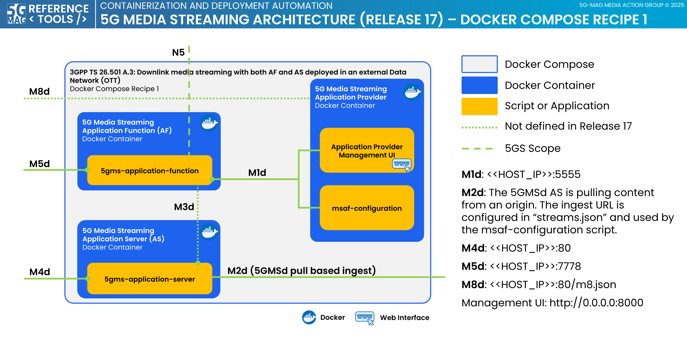

# 5G Media Streaming - Docker Compose Setup

This project provides a docker-compose setups to run
the [5GMS Application Function](https://github.com/5G-MAG/rt-5gms-application-function),
the [5GMS Application Server](https://github.com/5G-MAG/rt-5gms-application-server) and
the [5GMS Application Provider](https://github.com/5G-MAG/rt-5gms-application-provider)
in Docker container environments. 

## Docker Compose Recipe 1
The architecture of this Docker setup corresponds to 3GPP TS 26.501 A.3: Downlink media streaming with both AF and AS
deployed in an external Data Network (OTT). The Docker compose file starts all Docker containers on a single machine
and exposes reference points `M1`, `M4`, `M5` and `M8`.

