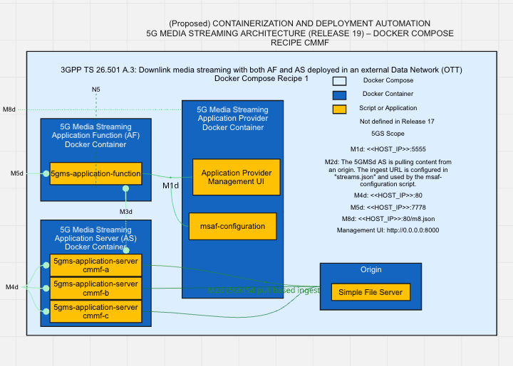

# 5G Media Streaming - Docker Compose Setup

This project provides a docker-compose setups to run
the [5GMS Application Function](https://github.com/5G-MAG/rt-5gms-application-function),
the [5GMS Application Server](https://github.com/5G-MAG/rt-5gms-application-server) and
the [5GMS Application Provider](https://github.com/5G-MAG/rt-5gms-application-provider)
in Docker container environments. 

## Docker Compose Recipe 1
The architecture of this Docker setup corresponds to 3GPP TS 26.501 A.3: Downlink media streaming with both AF and AS
deployed in an external Data Network (OTT). The Docker compose file starts all Docker containers on a single machine
and exposes reference points `M1`, `M4`, `M5` and `M8`.

## CMMF-related changes

CMMF Media Entrypoint, according to the published [3GPP spec](https://www.etsi.org/deliver/etsi_ts/126500_126599/126512/19.02.00_60/ts_126512v190200p.pdf), 
shall be made available via a URL. When mapped to the docker setup, the `m8.json` file will contain a URL to the CMMF Media Entrypoint.
The CMMF Media Entrypoint will then contain the URL to a MPD/m3u8 file. 
According to the spec: "It is assumed that CMMF transport resources for the media resources referenced within this MPD are accessible
from three service locations exposed by the 5GMSd AS at reference point M4d". With this in mind, the architecture of the docker setup
is modified as followed: 

### Changes to the client (upcoming)

In light of the changes to the docker setup described above, the client application, when reading the `m8.json` file, needs 
to be aware of the `contentType` field. If it encounters the `application/vnd.cmmf-configuration-information+json` content 
type, it shall configure and use a CMMF Media Access Client, which will fetch the CMMF Entrypoint configuration file, parse it, 
and extract the URL for the media content while setting up, in order to handle CMMF transport resources. The media URL should 
be passed back to the player in `mediaStreamHandler` for playback. 

