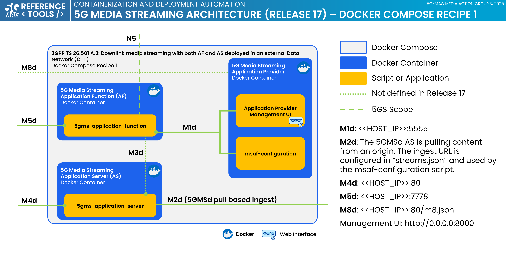

# 5G Media Streaming - Docker Compose Setup - Recipe 1

This project provides a docker-compose setup to run
the [5GMS Application Function](https://github.com/5G-MAG/rt-5gms-application-function),
the [5GMS Application Server](https://github.com/5G-MAG/rt-5gms-application-server) and
the [5GMS Application Provider](https://github.com/5G-MAG/rt-5gms-application-provider)
in a local Docker container environment, either standalone or together with a full 5G Core (5GC).

This folder includes Docker files for all the aforementioned projects. It includes two Docker Compose files for the
5GMS components: `docker-compose-5gms.yml` (with 5GC) and `docker-compose_5gms_without_5GC.yml` (standalone). An
additional `docker-compose-5gc.yml` file is provided to deploy the 5G Core based on Open5GS. The configuration files
included in this project can be edited on the host machine and are mounted to the respective Docker container during
runtime.

## Architecture

The architecture of this Docker setup corresponds to 3GPP TS 26.501 A.3: Downlink media streaming with both AF and AS
deployed in an external Data Network (OTT). The Docker Compose files start all Docker containers on a single machine
and expose reference points `M1`, `M4`, `M5` and `M8`.



## Required Configuration

### Configuration files

You need to provide two configuration changes to the `media.conf` and the `initial-config.json` file.

In `media.conf` add the IP of your host machine by replacing `<<ADD_YOUR_IP_HERE>>` e.g.:

````
m5_authority = 10.147.67.219:7778
````

In `initial-config.json` add the IP of your host machine by replacing `<<ADD_YOUR_IP_HERE>>` e.g.:

````
"domainNameAlias": "10.147.67.219"
````

These changes enable a 5G Media Streaming client to access the content via the `M4` interface exposed by the
`Application Server` on the host machine.

## Optional Configuration

The configuration files for the 5GMS Application Function and the 5GMS Application Server are located in
`application-server.conf` and one of two MSAF config files:

- `msaf.yaml` — for standalone use (without 5GC)
- `msaf_with_5GC.yaml` — for use with the 5G Core (`open5gsIntegration: true`)

The configuration files are mounted to the respective Docker container during runtime.

By default, the M1 and M5 interfaces of the Application Function run on ports `5555` and `7778` and are exposed to
the host machine.

The Application Server runs on port `80` which is also available on the host machine.

For details on the configuration options, please refer to our documentation of
the [Application Function](https://5g-mag.github.io/Getting-Started/pages/5g-media-streaming/usage/application-function/configuration-5GMSAF.html)
and
the [Application Server](https://5g-mag.github.io/Getting-Started/pages/5g-media-streaming/usage/application-server/testing-AS.html#testing).

In addition, we provide a static webserver to host metadata and poster images for the 5GMS Aware Application. The
configuration file for the webserver is located in `simple-express-server.conf`. By default, we use port `3344` for
the webserver. All files in the `simple-express-public` folder are hosted by the webserver and available at
`http://<YOUR_IP_ADDRESS>:3344/`.

## Installation

If you have not already done so, clone the repository:

```bash
cd ~
git clone https://github.com/5G-MAG/rt-5gms-examples.git
```

Navigate to the `recipe1` folder:

`cd ~/rt-5gms-examples/5gms-docker-setup/recipe1`

### Without 5G Core

Start Docker Compose to build the containers and start the services:

`docker compose -f docker-compose_5gms_without_5GC.yml up`

### With 5G Core

Create the shared Docker network (only needed once):

`docker network create 5g-mag`

Start the 5G Core containers:

`docker compose -f docker-compose-5gc.yml up -d`

Once the 5G Core is running, start the 5GMS components:

`docker compose -f docker-compose-5gms.yml up`

### Docker Monitor (optional)

A web-based monitor is available to inspect the status of all running containers. From the root of the repository:

`docker compose -f docker-compose-monitor.yml up -d`

Then open **http://localhost:3002** in your browser.

## Usage

### msaf-configuration

If `RUN_MSAF_CONFIGURATION_TOOL` is enabled in the Docker Compose file, the `msaf-configuration` tool is executed
when you launch the Docker containers. The `msaf-configuration` tool uses the `initial-config.json` to create
provisioning sessions and content hosting configurations via the `M1` endpoint of the `Application Function`. It
also creates an `m8.json` that serves as the starting point for the 5GMS Aware Application. For details refer to
the [Tutorial - 5GMSd: Basic end to end setup](https://5g-mag.github.io/Getting-Started/pages/5g-media-streaming/tutorials/end-to-end.html).

### Metadata for 5GMS Aware Application

Starting from version 1.3.0 the 5GMS Aware Application requires a metadata file to be able to access information about
the provided content. The metadata file provides a description of each content and also links to a poster image that
can be used by the 5GMS Aware Application. By default, the corresponding `metadata.json` file and the poster images
are hosted by a simple static webserver (see `simple-express-server` in the Docker Compose file).
To change the metadata, edit the `simple-express-public/metadata.json` file. To change the poster images, add or
remove files in the `simple-express-public/posters` folder.

### Management UI

If `RUN_MANAGEMENT_UI` is set to `true` in the Docker Compose file, the 5GMS Application Provider Management UI is
started and available at `http://127.0.0.1:8000/`.

### External REST client

After the containers are built and started, the 5GMS Application Function and the 5GMS Application Server are
available via the host machine. As an example, running the following curl command will create a provisioning session
via the `M1` interface of the Application Function:

````shell
curl -X POST http://localhost:5555/3gpp-m1/v2/provisioning-sessions \
     -H "Content-Type: application/json" \
     -d '{
           "aspId": "aspId",
           "appId": "appId",
           "provisioningSessionType": "DOWNLINK"
         }'
````

By default the following ports are exposed to the host machine:

* Application Function `M1` interface: Port `5555`
* Application Function `M5` interface: Port `7778`
* Application Server `M4` interface: Port `80`

## Tearing down

### Without 5G Core

`docker compose -f docker-compose_5gms_without_5GC.yml down`

### With 5G Core

To stop the 5GMS components:

`docker compose -f docker-compose-5gms.yml down`

To stop the 5G Core:

`docker compose -f docker-compose-5gc.yml down`

## FAQ

### `m8.json` is not created

Error message: `FileNotFoundError: [Errno 2] No such file or directory: '/shared/<<SOME_IP>>/m8.json'`

If you run into an issue where the `m8.json` is not created, make sure that the right folders are created inside the
`shared` folder. There should be a `localhost` folder, and inside that folder, there should be a `m8.json` file. In
addition, a similar folder with the IP of your host machine should be created. It also contains an `m8.json` file.

If one or both of these folders are missing, create them manually and run the Docker Compose command again.
